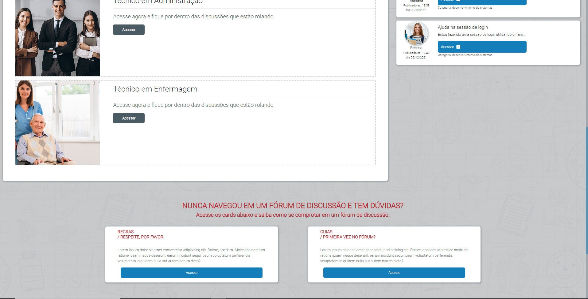
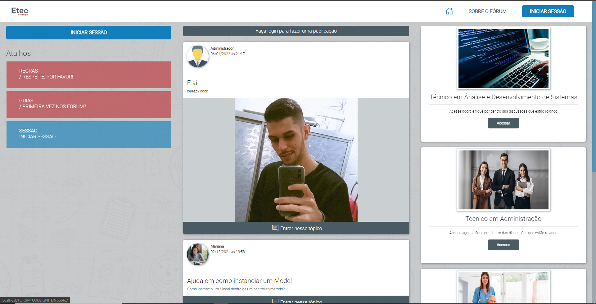
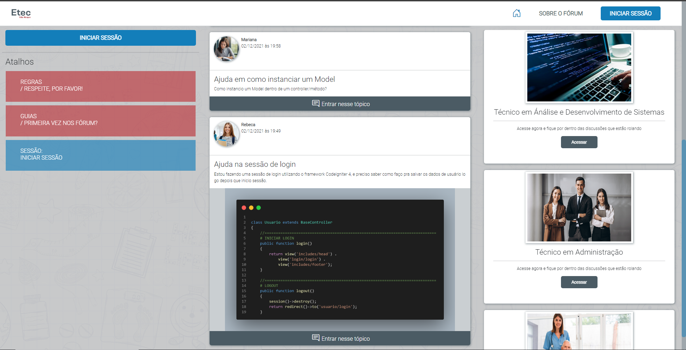
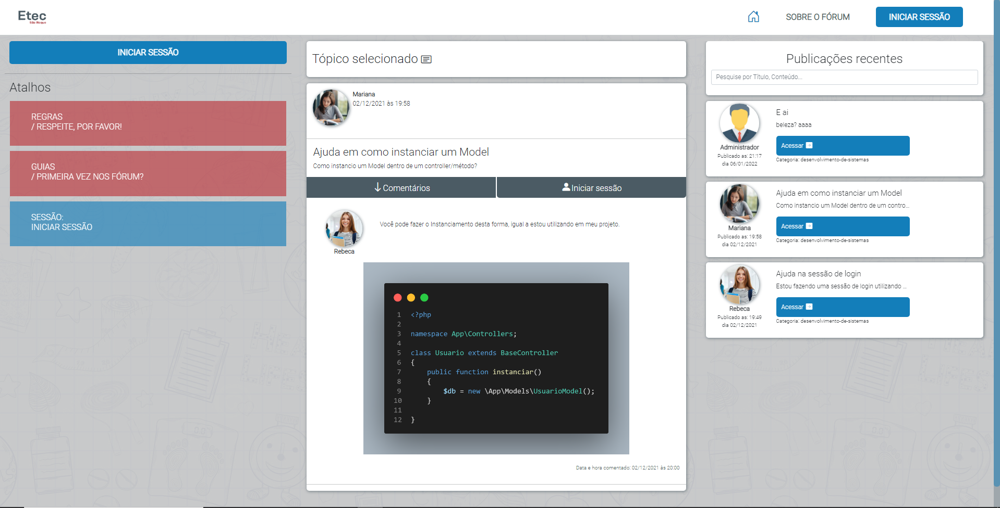

# Trabalho de conclusão do curso de Tec. em Análise e Desenvolvimento de sistemas
##### Intuito era criar um fórum de discussão para instituições, como base eleger a praticidade de ensino e ajuda para os alunos além de facilitar a comunicação entre eles. O Designer criado está o mais próximo de uma rede social para melhor interação do usuário.

## Ferramentas utilizadas para o desenvolvimento
* CodeIgniter v.4
* CSS
* Bootstrap v.5.1
* JQuery v.3
* AJAX
* MySQL
* PhotoShop

